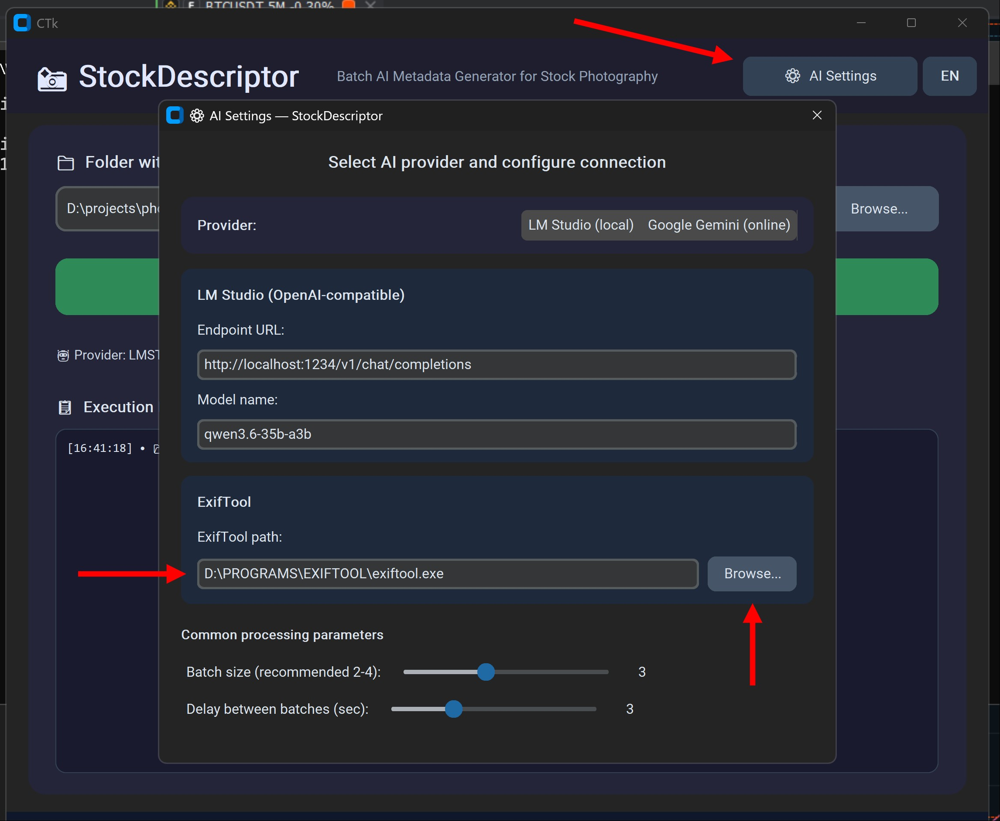

# 📸 StockDescriptor

**Batch describer for Photo Stocks** — мощный инструмент для подготовки, AI-анализа и обработки фотографий для стоковых платформ с автоматическим управлением метаданными EXIF и Obsidian-навигацией.

**НОВИНКА v2.2:** Параллельная загрузка на стоковые платформы (Shutterstock / Adobe Stock / Pond5) по SFTP, а также мультиязычный GUI (English / Русский) с переключателем языка, выводом логов в консоль и сохранением настроек.

Портфолио: https://stock.adobe.com/contributor/202223264/willyam

---
## ✨ Новый красивый GUI (рекомендуется)

Запустите современное окно одним кликом:

```batch
run_gui.bat
# или
python gui_launcher.py
```

### Что умеет GUI:

1. **Поле ввода пути к папке** + кнопка **«Обзор...»**
2. **Большая кнопка «🚀 ЗАПУСТИТЬ ПАЙПЛАЙН»** — выполняет полный цикл:
   - Создание миниатюр (THMBS/)
   - AI-генерация Title / Description / Keywords
   - Инжекция метаданных в оригиналы (EXIF)
   - Создание навигации для Obsidian `METADATA-NAV.md`
3. **Кнопка «⚙️ Настройки AI»**:
   - Переключатель **LM Studio (локально)** ↔ **Google Gemini (онлайн)**
   - Поля для URL/модели LM Studio
   - Поле для Gemini API Key (маскируется) + модель
   - Слайдеры размера батча и задержки
   - Ключ сохраняется в: `~/.stockdescriptor/config.json`
4. **Живой журнал выполнения** с цветными статусами
5. **Вывод в консоль** — все сообщения дублируются в терминал
6. **Переключатель языка** — переключение между EN/RU в любой момент
7. Автоматическое сохранение последней папки
8. **Секция «📤 Загрузка на стоковые платформы»** — параллельная загрузка по SFTP:
   - Флажки для **Shutterstock**, **Adobe Stock**, **Pond5**
   - Индивидуальные полосы прогресса с живыми счётчиками файлов
   - Кнопка **«📤 Загрузить выбранные»** запускает все выбранные платформы в параллельных потоках
   - Кнопка **«⚙️»** открывает окно **Настройки FTP загрузки** (хост / порт / имя пользователя / пароль / удалённый путь для каждой платформы, с переключателем видимости пароля 👁/🙈)
   - Флажок **«Автозагрузка на стоки после EXIF»** — запускает загрузку автоматически по завершении пайплайна
   - Загруженные файлы перемещаются в подпапку `_UPLOADED/`

**Преимущества GUI:**
- Не нужно помнить команды и флаги
- Удобный выбор между локальной и облачной нейросетью
- API ключи и FTP-учётные данные не попадают в репозиторий
- Красивый современный интерфейс (Dark + blue theme)

---

### 📤 Загрузка на стоковые платформы

StockDescriptor v2.2 может загружать обработанные JPG напрямую в аккаунты стоковых площадок по **SFTP** (порт 22):

| Платформа     | SFTP-хост по умолчанию                     |
| ------------- | ------------------------------------------ |
| Shutterstock  | `ftps.shutterstock.com`                  |
| Adobe Stock   | `sftp.contributor.adobestock.com`          |
| Pond5         | `ftp.pond5.com`                         |

Как это работает:
1. Откройте **⚙️ Настройки FTP загрузки** и введите хост/порт/имя пользователя/пароль/удалённый путь для нужных платформ.
2. Отметьте флажками платформы, на которые нужно загрузить.
3. Нажмите **«📤 Загрузить выбранные»** — каждая платформа загружается в своём потоке с живой полосой прогресса.
4. (Опционально) Включите **«Автозагрузка на стоки после EXIF»**, чтобы загрузка запускалась автоматически в конце пайплайна.

Загруженные файлы перемещаются в папку `_UPLOADED/`, чтобы не загружаться повторно при следующем запуске.

> ⚠️ Учётные данные хранятся только в вашем пользовательском профиле (см. ниже) и **никогда** не попадают в репозиторий.

---

## 🎯 Основные возможности (CLI тоже работает)

### 1. 🖼️ Масштабирование для Vision API
`processing/resize_for_vision.ps1` — пропорционально уменьшает до 1024px, сохраняет в `THMBS/`

### 2. 🤖 AI-генерация метаданных
`processing/batch_metadata.py` теперь поддерживает **два провайдера**:
- **LM Studio** (по умолчанию, локально, OpenAI-совместимый эндпоинт)
- **Google Gemini** (онлайн, требуется API ключ)

Поддерживает resume, --check-errs, mock-режим, инкрементальную запись.

### 3. 🏷️ Инжекция EXIF + Obsidian nav
Полный пайплайн одной командой.

---

## 🚀 Быстрый старт (GUI — самый простой способ)

```batch
cd d:\projects\AI\stock-descriptor
run_gui.bat
```

1. Нажмите **«Обзор...»** → выберите папку с JPG
2. (Опционально) **«⚙️ Настройки AI»** → выберите Gemini и вставьте ключ
3. Нажмите **«🚀 ЗАПУСТИТЬ ПАЙПЛАЙН»**
4. Следите за журналом — готово!

---

## ⚙️ CLI (для скриптов / продвинутых пользователей)

```powershell
# Активировать venv
.\venv\Scripts\Activate.ps1

# Полный пайплайн через bat (старый способ)
processing\run_pipeline.bat "C:\путь\к\вашим\изображениям"

# Прямой запуск с выбором провайдера
python processing\batch_metadata.py "C:\путь\к\изображениям" --provider gemini --model gemini-1.5-flash-latest
```

**Новые флаги batch_metadata.py:**
- `--provider lmstudio|gemini`
- `--model "название-модели"`
- `--api-key "ВАШ_КЛЮЧ"` (для Gemini; лучше использовать GUI или переменную окружения)

---

## 📁 Структура проекта (обновлённая)

```
StockDescriptor/
├── gui_launcher.py          # GUI-приложение (v2.2: + панель загрузки на стоки)
├── run_gui.bat              # удобный запуск GUI
├── requirements.txt         # + customtkinter, paramiko
├── README_EN.md             # Документация на английском
├── README_RU.md             # Документация на русском
├── processing/
│   ├── config_manager.py    # загрузка/сохранение настроек + API ключей
│   ├── batch_metadata.py    # поддержка Gemini + llm_config
│   ├── resize_for_vision.ps1
│   ├── write_exif.ps1
│   ├── create-metadata-nav-modified.ps1
│   ├── run_pipeline.bat
│   └── ...
├── scripts/
│   └── upload_to_stocks.py  # ← НОВОЕ: параллельная SFTP-загрузка (Shutterstock/Adobe/Pond5)
├── templates/
└── README.md
```

---

## 🔐 Хранение ключей и учётных данных (шифрование)

Все конфиденциальные данные (API-ключи Gemini, FTP/SFTP-пароли стоковых платформ) хранятся **в зашифрованном виде**:

- **`~/.stockdescriptor/secrets.enc`** — зашифрованные ключи и пароли (Fernet-шифрование)
- **`~/.stockdescriptor/.key`** — ключ шифрования (создаётся автоматически при первом запуске)
- **`~/.stockdescriptor/config.json`** — публичные настройки (провайдер, модель, пути и т.д.), пароли в этом файле **всегда пустые**
- **`~/.stockdescriptor/upload_config.json`** больше **не используется** — все учётные данные загрузки хранятся в основном конфиге и шифруются

> 🔒 Пароли вводятся через GUI в окне «⚙️ Настройки FTP загрузки» и автоматически шифруются при сохранении.
> Расшифровка происходит только в оперативной памяти при загрузке или выполнении загрузки на стоки.

- Файлы создаются автоматически в вашем домашнем каталоге
- **Никогда не коммитьте эти файлы в git** (они исключены из репозитория)
- Для безопасности: храните компьютер под паролем

---

## 🛠️ Установка / Обновление

### 1. Установите ExifTool

Этот проект использует **ExifTool** для инжекции метаданных в изображения.  
Скачайте и установите его с официального сайта: [https://exiftool.org](https://exiftool.org)

- **Windows:** скачайте `exiftool-12.xx.zip`, извлеките `exiftool.exe` (переименуйте из `exiftool(-k).exe`) и поместите в постоянную папку (например, `D:\PROGRAMS\EXIFTOOL\`).
- Убедитесь, что путь совпадает с указанным в `processing/write_exif.ps1`, или отредактируйте скрипт под ваш путь.


 
 

### 2. Установите Python-зависимости

```powershell
cd d:\projects\AI\stock-descriptor
python -m venv venv
.\venv\Scripts\Activate.ps1
pip install -r requirements.txt
```

Готово! Теперь можно запускать `run_gui.bat`

---

## 📝 Вывод логов в консоль

Все сообщения из GUI теперь также выводятся в терминал/консоль, из которой вы запустили приложение. Это полезно для:
- Отладки и поиска проблем
- Запуска GUI в автоматизированных средах
- Ведения терминальной записи выполнения пайплайна

---

**Приятной работы с вашими стоковыми фотографиями!** 🦈📸
