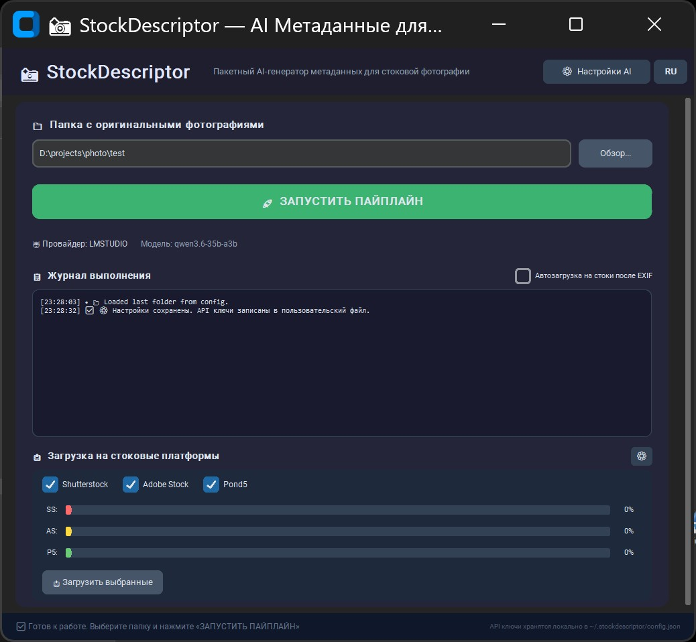

# 📸 StockDescriptor

**Batch describer for Photo Stocks** — мощный инструмент для подготовки, AI-анализа и обработки фотографий для стоковых платформ с автоматическим управлением метаданными EXIF и Obsidian-навигацией.

**НОВИНКА v2.1:** Мультиязычный GUI (English / Русский) с переключателем языка, выводом логов в консоль и сохранением языка в настройках.

Портфолио: https://stock.adobe.com/contributor/202223264/willyam

---
## ✨ Новый красивый GUI (рекомендуется)

Запустите современное окно одним кликом:

```batch
run_gui.bat
# или
python gui_launcher.py
```

### Что умеет GUI:

1. **Поле ввода пути к папке** + кнопка **«Обзор...»**
2. **Большая кнопка «🚀 ЗАПУСТИТЬ ПАЙПЛАЙН»** — выполняет полный цикл:
   - Создание миниатюр (THMBS/)
   - AI-генерация Title / Description / Keywords
   - Инжекция метаданных в оригиналы (EXIF)
   - Создание навигации для Obsidian `METADATA-NAV.md`
3. **Кнопка «⚙️ Настройки AI»**:
   - Переключатель **LM Studio (локально)** ↔ **Google Gemini (онлайн)**
   - Поля для URL/модели LM Studio
   - Поле для Gemini API Key (маскируется) + модель
   - Слайдеры размера батча и задержки
   - Ключ сохраняется в: `~/.stockdescriptor/config.json`
4. **Живой журнал выполнения** с цветными статусами
5. **Вывод в консоль** — все сообщения дублируются в терминал
6. **Переключатель языка** — переключение между EN/RU в любой момент
7. Автоматическое сохранение последней папки

**Преимущества GUI:**
- Не нужно помнить команды и флаги
- Удобный выбор между локальной и облачной нейросетью
- API ключи не попадают в репозиторий
- Красивый современный интерфейс (Dark + blue theme)

---

## 🎯 Основные возможности (CLI тоже работает)

### 1. 🖼️ Масштабирование для Vision API
`processing/resize_for_vision.ps1` — пропорционально уменьшает до 1024px, сохраняет в `THMBS/`

### 2. 🤖 AI-генерация метаданных
`processing/batch_metadata.py` теперь поддерживает **два провайдера**:
- **LM Studio** (по умолчанию, локально, OpenAI-совместимый эндпоинт)
- **Google Gemini** (онлайн, требуется API ключ)

Поддерживает resume, --check-errs, mock-режим, инкрементальную запись.

### 3. 🏷️ Инжекция EXIF + Obsidian nav
Полный пайплайн одной командой.

---

## 🚀 Быстрый старт (GUI — самый простой способ)

```batch
cd d:\projects\AI\stock-descriptor
run_gui.bat
```

1. Нажмите **«Обзор...»** → выберите папку с JPG
2. (Опционально) **«⚙️ Настройки AI»** → выберите Gemini и вставьте ключ
3. Нажмите **«🚀 ЗАПУСТИТЬ ПАЙПЛАЙН»**
4. Следите за журналом — готово!

---

## ⚙️ CLI (для скриптов / продвинутых пользователей)

```powershell
# Активировать venv
.\venv\Scripts\Activate.ps1

# Полный пайплайн через bat (старый способ)
processing\run_pipeline.bat "C:\путь\к\вашим\изображениям"

# Прямой запуск с выбором провайдера
python processing\batch_metadata.py "C:\путь\к\изображениям" --provider gemini --model gemini-1.5-flash-latest
```

**Новые флаги batch_metadata.py:**
- `--provider lmstudio|gemini`
- `--model "название-модели"`
- `--api-key "ВАШ_КЛЮЧ"` (для Gemini; лучше использовать GUI или переменную окружения)

---

## 📁 Структура проекта (обновлённая)

```
StockDescriptor/
├── gui_launcher.py          # ← НОВОЕ: красивое GUI-приложение
├── run_gui.bat              # ← НОВОЕ: удобный запуск GUI
├── requirements.txt         # + customtkinter
├── README_EN.md             # Документация на английском
├── README_RU.md             # Документация на русском
├── processing/
│   ├── config_manager.py    # ← НОВОЕ: загрузка/сохранение настроек + API ключей
│   ├── batch_metadata.py    # Обновлён: поддержка Gemini + llm_config
│   ├── resize_for_vision.ps1
│   ├── write_exif.ps1
│   ├── create-metadata-nav-modified.ps1
│   ├── run_pipeline.bat
│   └── ...
├── templates/
└── README.md
```

---

## 🔐 Хранение API ключей

- При первом вводе ключа Gemini в настройках GUI он сохраняется в:
  `~/.stockdescriptor/config.json`
- Файл создаётся автоматически в вашем домашнем каталоге
- **Никогда не коммитьте этот файл в git** (он уже в .gitignore логике)
- Для безопасности: храните компьютер под паролем

---

## 🛠️ Установка / Обновление

### 1. Установите ExifTool

Этот проект использует **ExifTool** для инжекции метаданных в изображения.  
Скачайте и установите его с официального сайта: [https://exiftool.org](https://exiftool.org)

- **Windows:** скачайте `exiftool-12.xx.zip`, извлеките `exiftool.exe` (переименуйте из `exiftool(-k).exe`) и поместите в постоянную папку (например, `D:\PROGRAMS\EXIFTOOL\`).
- Убедитесь, что путь совпадает с указанным в `processing/write_exif.ps1`, или отредактируйте скрипт под ваш путь.


 

### 2. Установите Python-зависимости

```powershell
cd d:\projects\AI\stock-descriptor
python -m venv venv
.\venv\Scripts\Activate.ps1
pip install -r requirements.txt
```

Готово! Теперь можно запускать `run_gui.bat`

---

## 📝 Вывод логов в консоль

Все сообщения из GUI теперь также выводятся в терминал/консоль, из которой вы запустили приложение. Это полезно для:
- Отладки и поиска проблем
- Запуска GUI в автоматизированных средах
- Ведения терминальной записи выполнения пайплайна

---

**Приятной работы с вашими стоковыми фотографиями!** 🦈📸